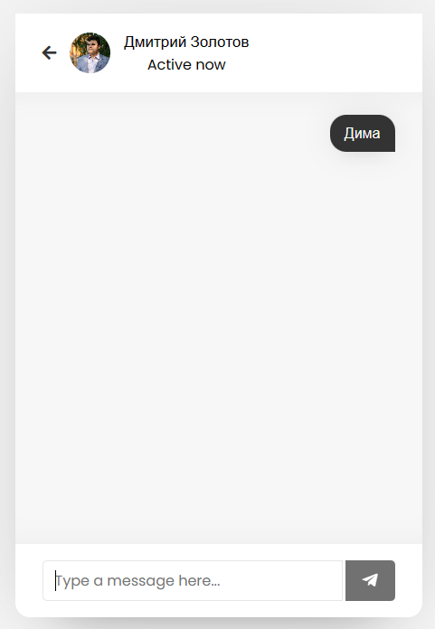

# Отчет по лабораторной работе №3 
## "Изучение технологии AJAX"
## по курсу "Основы программирования"
### *Работу выполнил студент группы №3131 Федоров Григорий*

#### Цель работы:   
  
Разработать и реализовать анонимный чат с возможностью создания каналов. В интерфейсе отображается несколько каналов, пользователь может либо подключиться к существующему, либо создать новый. Сообщения доставляются пользователю без обновления страницы.

#### Пользовательский интерфейс:

* Форма входа:

* Форма регистрации:

* Форма зарегистрированного пользователя:

* Форма чата:

#### Пользовательские сценарии работы:

1. Пользователь вводит в адресной строке index.php и попадает на форму регистрации. После регистрации пользователь попадает на страницу с каналами.
2. Выбрав канал, пользователь попадает на страницу сhat.php с определенным пользователем. 
3. Дальше пользователь может написать и отправить его. Также виден статус пользователя.

#### API сервера и хореография:

Сервер работает с помощью GET-запросов, POST-запросов и AJAX-запросов.   
Также используются глобальные переменные, такие как $_SESSION[*name*] и другие. 

index.php, при отсутствии переменной $_SESSION['user'], перенаправляет пользователя на страницу auth.php. Если переменная есть, то перенаправление не происходит. При нажатии на кнопку Logout сервер отправляет запрос в logout.php (в результате запроса переменная $_SESSION['user']) будет уничтожена и направляет пользователя на auth.php.

Со страницы auth.php, при нажатии кнопки "Signup", сервер отправляет запрос на signup.php (тут данные будут проверены и, если всё ок, внесены в БД), передавая туда введённые в поля "First name", "Second name", "Email adress", "Password"  и "Image" данные. signup.php после обработки данных возвращает индикатор, в зависимости от значения которого будет выведено сообщение об ошибке или успешной регистрации.

При нажатии на странице auth.php кнопки "Login now", сервер направит на signin.php запрос с введёнными данными. signin.php проверяет данные на корректность и возвращает индикатор, в зависимости от значения которого будет выведено сообщение об ошибке или пользователь получит переменную $_SESSION['user']) и будет перенаправлен на index.php.

Со страницы index.php, при нажатии на пользователя которому ты хочешь написать сообщение, перенаправляет пользователя на страницу chat.php. chat.php отправляет запрос на добавление нового сообщения.

#### Структура базы данных:

Используются две таблицы:

- Таблица messages:

`msg_id` int(11) NOT NULL, PRIMARY KEY, AUTO_INCREMENT - уникальный идентификатор сообщения
   
`incoming_msg_id` int(255) NOT NULL - идентификатор получателя
  
`outgoing_msg_id` int(255) NOT NULL - идентификатор отправителя
  
`msg` varchar(1000) NOT NULL - сообщение
  
- Таблица users:

`user_id` int(11) NOT NULL, PRIMARY KEY, AUTO_INCREMENT - количество идентификаторов пользователей

`unique_id` int(255) NOT NULL - уникальный идентификатор пользователя
  
`fname` varchar(255) NOT NULL - Имя
  
`lname` varchar(255) NOT NULL - Фамилия
  
  `email` varchar(255) NOT NULL - почта
  
  `password` varchar(255) NOT NULL - пароль
  
  `img` varchar(255) NOT NULL - изображение
  
  `status` varchar(255) NOT NULL - онлайн/оффлайн

#### Алгоритмы работы: 

* Алгоритм работы для форм signup.php и register.php:

